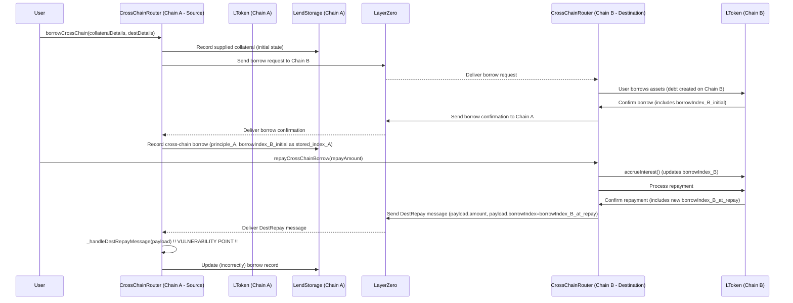

Cheery Coffee Chinchilla

High

# francoHacker - Critical Cross-Chain Debt Misaccounting in `_handleDestRepayMessage` Leads to Protocol Value Leakage and Unreliable Liquidations

francoHacker

High

---

**Summary:**
The `_handleDestRepayMessage` function in `CrossChainRouter`, responsible for processing debt repayments made on a destination chain (Chain B) and updating the corresponding borrow record on the source chain (Chain A), contains critical flaws. It fails to: (1) call `accrueInterest()` on the local LToken (Chain A) before debt calculations, thus using a potentially stale local `borrowIndex`, and (2) it incorrectly uses `payload.borrowIndex` (the `borrowIndex` from Chain B) in its primary debt calculation formula. This results in a mathematically unsound computation of the "current borrow" amount on Chain A, leading to inaccurate updates of the outstanding principal. This misaccounting can cause the protocol to understate borrower debt (leading to value leakage) or overstate it (unfair to users), corrupts fundamental protocol state, and critically, propagates incorrect debt values into liquidation calculations, potentially triggering unjust or failed liquidations. Malicious actors could deliberately time repayments to exploit index divergences for profit.

**1. Context: Cross-Chain Borrow Lifecycle & `borrowIndex`**

A typical cross-chain borrow involves several steps, with `_handleDestRepayMessage` being a crucial synchronization point:



The **`borrowIndex`** is a crucial concept: it's a cumulative factor representing total accrued interest on a principal amount. If a loan starts when `borrowIndex` is `S` (stored principal borrow index) and the current market `borrowIndex` is `M`, the current debt value is `Principal * (M / S)`. A `borrowIndex` of `1.1` signifies 10% interest has accrued since the `borrowIndex` was `1.0`.

**2. Root Cause: Flawed Debt Calculation Logic in `_handleDestRepayMessage`**

When a `DestRepay` message (confirming repayment on Chain B) arrives on Chain A, `_handleDestRepayMessage` executes flawed logic:
*   **Missing Local Interest Accrual:** It **fails** to call `accrueInterest()` on `LToken_A` (the LToken for `payload.srcToken` on Chain A). Consequently, `userBorrows[index].borrowIndex` (the `stored_borrowIndex_A` from when the loan was last updated on Chain A) is likely stale compared to the true `current_market_borrowIndex_A`.
*   **Invalid Cross-Index Calculation:** The core calculation `currentBorrow = (userBorrows[index].principle * payload.borrowIndex) / userBorrows[index].borrowIndex;` is fundamentally incorrect. It attempts to scale `principle_A` (the principal amount as understood on Chain A) using `payload.borrowIndex` (the `borrowIndex_B_at_repay` from Chain B's market state) and the (stale) `stored_borrowIndex_A`.
    *   This formula effectively becomes: `currentBorrow_flawed = principle_A * (borrowIndex_B_at_repay / stored_borrowIndex_A)`.
    This mixes indices from different markets (Chain A vs. Chain B) and different points in time, yielding a `currentBorrow_flawed` value that does not represent the actual debt on Chain A.
*   **Incorrect State Update:** The `payload.amount` (underlying tokens repaid on Chain B) is subtracted from this `currentBorrow_flawed`. The new principal on Chain A is derived from this incorrect subtraction, and critically, the new `borrowIndex` for the position on Chain A is incorrectly set to `payload.borrowIndex` (i.e., `borrowIndex_B_at_repay`). This corrupts the local accounting for the loan.

Source Code Reference:
`CrossChainRouter.sol#L545-L571`
[https://github.com/sherlock-audit/2025-05-lend-audit-contest/blob/main/Lend-V2/src/LayerZero/CrossChainRouter.sol#L545](https://github.com/sherlock-audit/2025-05-lend-audit-contest/blob/main/Lend-V2/src/LayerZero/CrossChainRouter.sol#L545)
```solidity
// CrossChainRouter.sol - _handleDestRepayMessage (Vulnerable Snippet)
function _handleDestRepayMessage(LZPayload memory payload, uint32 srcEid) private {
    // ... find borrow record `userBorrows[index]` ...
    LendStorage.Borrow[] memory userBorrows = lendStorage.getCrossChainBorrows(payload.sender, payload.srcToken);
    // CRITICAL POINT 1: No LToken_A.accrueInterest() call.
    // `userBorrows[index].borrowIndex` is stale stored_borrowIndex_A.
    // `payload.borrowIndex` is borrowIndex_B from remote chain.
    uint256 currentBorrow = (userBorrows[index].principle * payload.borrowIndex) / userBorrows[index].borrowIndex; // CRITICAL POINT 2: Flawed calculation

    if (payload.amount >= currentBorrow) { /* ... */ } else {
        userBorrows[index].principle = currentBorrow - payload.amount; // New principal based on flawed currentBorrow
        userBorrows[index].borrowIndex = payload.borrowIndex; // CRITICAL POINT 3: Incorrectly stores borrowIndex_B for Chain A record
        // ...
    }
    // ...
}
```

**3. Internal & External Pre-conditions:**
*   Internal: An active cross-chain borrow exists. A repayment message from Chain B is being processed. The `stored_borrowIndex_A` for the loan on Chain A is stale (lower than the actual `current_market_borrowIndex_A` if interest had been accrued).
*   External: LayerZero message delivery is successful. The `borrowIndex` values on Chain A and Chain B can and will naturally diverge due to different market conditions (utilization, interest rate models) and timing of interest accrual.

**4. Attack Path & Deliberate Exploitation:**

An attacker can exploit this by monitoring the `borrowIndex` on Chain A (`LToken_A`) and Chain B (`LToken_B`).

1.  Attacker `X` takes a large cross-chain loan: `principle_A = 1,000,000 USDC` is recorded on Chain A, with `stored_borrowIndex_A = 1.0`.
2.  Attacker `X` waits or influences conditions such that:
    *   `LToken_A` on Chain A has minimal interaction, so its `stored_borrowIndex_A` remains `1.0` (no `accrueInterest` calls). However, the *true* underlying `current_market_borrowIndex_A` (if accrued) would be, say, `1.1` (10% interest). True debt on Chain A: `1,100,000 USDC`.
    *   `LToken_B` on Chain B experiences high utilization or has a different interest rate model, causing its `borrowIndex_B_at_repay` to become significantly higher, e.g., `1.5`.
3.  Attacker `X` makes a small partial repayment on Chain B, e.g., `payload.amount = 10,000 USDC`. This triggers a `DestRepay` message to Chain A with `payload.borrowIndex = 1.5`.
4.  On Chain A, `_handleDestRepayMessage` executes:
    *   No `accrueInterest()` on `LToken_A`.
    *   Flawed `currentBorrow = (1,000,000 * 1.5) / 1.0 = 1,500,000 USDC`. (This massively overstates the true current debt of `1,100,000 USDC` on Chain A).
    *   New `principle_A_new = 1,500,000 - 10,000 = 1,490,000 USDC`.
    *   New `stored_borrowIndex_A_new = 1.5`.
5.  The attacker's debt on Chain A is now recorded as `1,490,000 USDC` principal at `borrowIndex 1.5`.
    If the `current_market_borrowIndex_A` is still `1.1`, the actual value of this (incorrectly recorded) debt is `1,490,000 * 1.1 / 1.5 = 1,092,666 USDC`.
    The true remaining debt should have been `1,100,000 - 10,000 = 1,090,000 USDC`.
    In this specific scenario, the debt is slightly overstated. However, an attacker would aim for parameters where the resulting *actual value* of the new principal at the new (incorrect) index is *lower* than the true remaining debt. For instance, if `payload.borrowIndex` was lower than `stored_borrowIndex_A`, `currentBorrow` would be understated. The key is the misapplication of indices leads to incorrect principal adjustments. The attacker profits by repaying less than the actual accrued interest or by having their principal reduced by more than their repayment value when normalized.

**5. Impact & Quantified Risk:**

*   **Incorrect Debt Tracking & Protocol Value Leakage:** This is the most severe impact. The protocol may understate the debt owed by borrowers.
    *   Example (Simplified to show understatement): Assume `stored_borrowIndex_A = 1.2`, `current_market_borrowIndex_A` (if accrued) = `1.25`. True debt for 1M principal = `1,041,667`. Attacker repays `100k` on Chain B where `payload.borrowIndex = 1.0` (lower than local stored).
    *   Flawed `currentBorrow = (1,000,000 * 1.0) / 1.2 = 833,333`.
    *   New `principle = 833,333 - 100,000 = 733,333`. New `stored_index = 1.0`.
    *   Value of this new principal at `current_market_borrowIndex_A` (`1.25`) = `733,333 * 1.25 / 1.0 = 916,666`.
    *   True remaining debt should be `1,041,667 - 100,000 = 941,667`.
    *   The protocol now believes the debt is effectively `916,666` when it should be `941,667`. Loss: `~25,000 USDC` on a 1M loan from one such operation.
    | True Debt (Chain A, Underlying) | Repayment (Underlying) | True Remaining Debt (Underlying) | Flawed Stored Principal & Index | Effective Debt Value with Flawed State | Protocol Loss (Underlying) |
    |---------------------------------|------------------------|------------------------------------|---------------------------------|----------------------------------------|----------------------------|
    | 1,041,667 USDC                  | 100,000 USDC           | 941,667 USDC                       | 733,333 (at index 1.0)          | 916,666 USDC (at mkt index 1.25)       | 25,001 USDC                |
*   **Compromised Liquidations:** Liquidations calculate `borrowBalance` using the stored (and now corrupted) principal and `borrowIndex`.
    *   If debt is understated: Positions that should be liquidable might appear healthy, putting protocol funds at risk from uncollateralized debt.
    *   If debt is overstated (less likely with the specific formula but possible with other index misuses): Users might be unjustly liquidated.
*   **State Inconsistency & Unreliable LEND Distribution:** Fundamental accounting is broken. LEND rewards distribution based on borrow amounts will be skewed.
*   **Accumulative Effect:** The error is not self-correcting. Each `DestRepay` message processed incorrectly can further corrupt the state for that borrow, and these discrepancies can compound over time or across multiple borrows.

**Severity: Critical**

This vulnerability allows for direct manipulation of core debt accounting, leading to potential protocol insolvency through value leakage, unreliable liquidation mechanisms, and an untrustworthy ledger. The ability for an attacker to deliberately influence parameters to their benefit by timing repayments on one chain to exploit stale or mismatched indices on another makes this a critical flaw.

**6. PoC (Conceptual - Foundry/Hardhat):**
(The PoC would aim to demonstrate the scenario in section 4 or the table in section 5, by:
1.  Setting up a cross-chain borrow with initial `principle_A` and `stored_borrowIndex_A`.
2.  Advancing time/blocks on Chain A to ensure `current_market_borrowIndex_A` (if `accrueInterest` were called) is higher than `stored_borrowIndex_A`.
3.  Crafting an `LZPayload` with a `payload.borrowIndex` (from Chain B) that, when used in the flawed formula, results in a new stored principal and index on Chain A whose actual value (when assessed against `current_market_borrowIndex_A`) is less than what the true remaining debt should be.
4.  Asserting this difference.)

**7. Mitigation:**

The `_handleDestRepayMessage` function **must** perform calculations based *only* on Chain A's local market conditions and the actual amount repaid.

```solidity
// CrossChainRouter.sol - Mitigated _handleDestRepayMessage (Conceptual)
function _handleDestRepayMessage(LZPayload memory payload, uint32 srcEid) private {
    (bool found, uint256 index) = lendStorage.findCrossChainBorrow(payload.sender, payload.srcToken, srcEid, currentEid, payload.destlToken);
    require(found, "Borrow position not found");

    // It's generally safer to operate on a copy if complex logic follows before writing,
    // or get a storage pointer if direct updates are intended and safe.
    // For this example, assume we fetch and then update.
    LendStorage.Borrow memory userBorrowPosition = lendStorage.getCrossChainBorrows(payload.sender, payload.srcToken)[index];

    // 1. Accrue interest on the local LToken (Chain A) to get the current market state
    address localLTokenAddress = lendStorage.underlyingTolToken(payload.srcToken);
    LTokenInterface(localLTokenAddress).accrueInterest();
    uint256 current_market_borrowIndex_A = LTokenInterface(localLTokenAddress).borrowIndex();

    // 2. Calculate current local debt in underlying terms, using Chain A's current market index
    uint256 current_debt_underlying_A = (userBorrowPosition.principle * current_market_borrowIndex_A) / userBorrowPosition.borrowIndex;

    // 3. Apply the repayment amount (payload.amount is in underlying terms from Chain B)
    uint256 remaining_debt_underlying_A;
    if (payload.amount >= current_debt_underlying_A) {
        // Full repayment
        lendStorage.removeCrossChainBorrow(payload.sender, payload.srcToken, index);
        // Consider also removing from userBorrowedAssets if this was the last borrow of this type/token
        if (lendStorage.getCrossChainBorrows(payload.sender, payload.srcToken).length == 0) { // Check if array is now empty
            lendStorage.removeUserBorrowedAsset(payload.sender, localLTokenAddress);
        }
        remaining_debt_underlying_A = 0; // For event or internal logic
    } else {
        // Partial repayment
        remaining_debt_underlying_A = current_debt_underlying_A - payload.amount;

        // 4. Update local storage correctly:
        // New principal is the remaining debt in underlying terms.
        // New borrowIndex is the current market index of Chain A.
        userBorrowPosition.principle = remaining_debt_underlying_A;
        userBorrowPosition.borrowIndex = current_market_borrowIndex_A;
        
        lendStorage.updateCrossChainBorrow(payload.sender, payload.srcToken, index, userBorrowPosition);
    }

    lendStorage.distributeBorrowerLend(localLTokenAddress, payload.sender);
    // Emit event with actual amount repaid (payload.amount)
    emit RepaySuccess(payload.sender, payload.srcToken, payload.amount);
}
```
**Key Mitigation Steps:**
1.  **Accrue Local Interest:** Mandatorily call `LToken_A.accrueInterest()` at the beginning of the function.
2.  **Use Local Indices for Local Debt:** Calculate the current debt on Chain A using `current_market_borrowIndex_A` and the `stored_borrowIndex_A` (from `userBorrowPosition.borrowIndex`).
3.  **Subtract Repaid Underlying:** Subtract `payload.amount` (which is the underlying amount repaid on Chain B) from this correctly calculated `current_debt_underlying_A`.
4.  **Store Consistent Local State:** The new `principle` stored on Chain A should be the `remaining_debt_underlying_A`. The new `borrowIndex` stored on Chain A should be the `current_market_borrowIndex_A`. **The `payload.borrowIndex` (from Chain B) must not be used to update Chain A's state or in Chain A's debt calculations.**

---