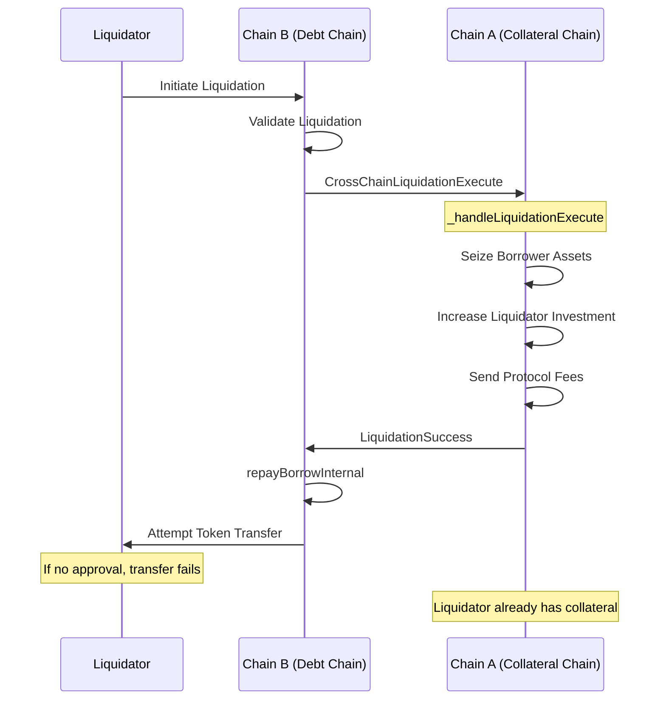

Broad Hazel Frog

High

# H-02 Cross-Chain Liquidation Flow Allows Liquidators to Gain Collateral Without Repaying Debt

### Summary

During the cross-chain liquidation process, a malicious liquidator can initiate a liquidation, receive the seized collateral in one chain, and then fail to complete the repayment in the other chain by not approving the token transfer. This allows the liquidator to gain the collateral without actually repaying the debt.

### Root Cause

The root cause lies in the order of operations in the cross-chain liquidation flow. The protocol first seizes the borrower's collateral and increases the liquidator's investment in Chain A through the [_handleLiquidationExecute](https://github.com/sherlock-audit/2025-05-lend-audit-contest/blob/main/Lend-V2/src/LayerZero/CrossChainRouter.sol#L312) function, before attempting to collect the repayment in Chain B. When the liquidation flow reaches the [repayBorrowInternal](https://github.com/sherlock-audit/2025-05-lend-audit-contest/blob/main/Lend-V2/src/LayerZero/CoreRouter.sol#L483) function in Chain B, the liquidator has already gained the investment in Chain A for the seized tokens. If the liquidator hasn't approved the token transfer, the final step will fail in Chain B, but the liquidator keeps the seized collateral from Chain A.

### Internal Pre-conditions

None, the issue exists from the very beginning.

### External Pre-conditions

1. A user has borrowed tokens in Chain B using collateral in Chain A
2. The borrower's position has become liquidatable
3. The liquidator has not pre-approved the token transfer for the repayment amount

### Attack Path

1. Liquidator initiates liquidation in Chain B
2. Protocol validates the liquidation and sends a cross-chain message to Chain A
3. Chain A executes `_handleLiquidationExecute` which:
   - Seizes the borrower's collateral
   - Increases the liquidator's investment
   - Sends a portion to the protocol as fees
4. Chain A sends a cross-chain message back to Chain B with `ContractType.LiquidationSuccess`
5. Chain B attempts to collect the repayment through `CoreRouter.repayBorrowInternal`
6. The repayment fails because the liquidator never approved the token transfer
7. The liquidator keeps the seized collateral in Chain A without completing the repayment in Chain B

### Impact

1. Steal collateral from the protocol without actually repaying the debt
2. Can create a situation where the protocol becomes undercollateralized

### PoC

_No response_

### Mitigation

_No response_